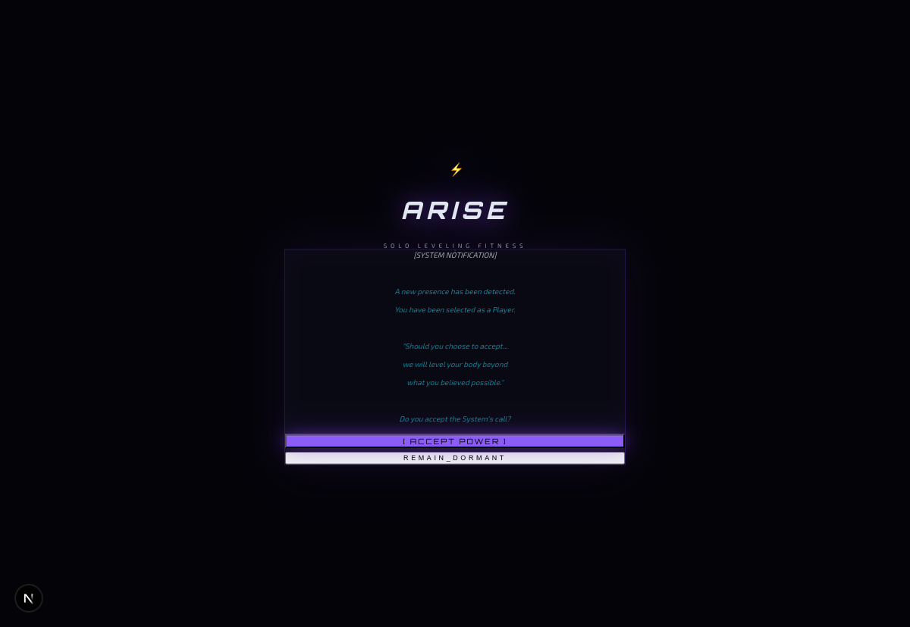
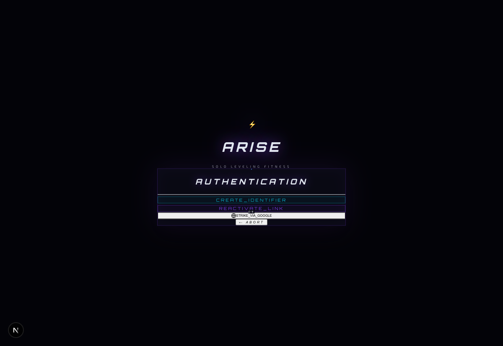
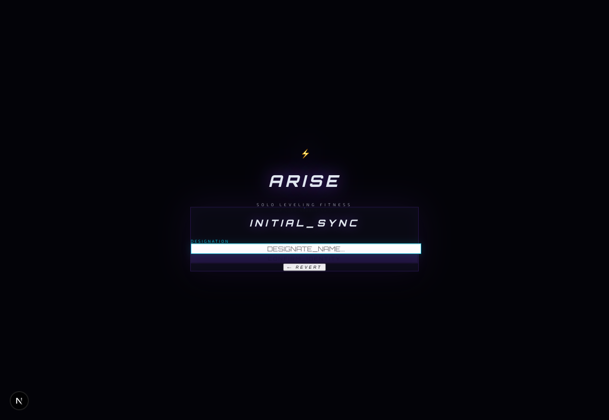

<div align="center">

# ⚔️ ARISE — Solo Leveling Fitness

**Level up your physical form. Arise, Hunter.**

[](https://nextjs.org)
[](https://typescriptlang.org)
[](https://supabase.com)
[](https://threejs.org)
[](https://tailwindcss.com)

[](/)
[](/)
[](/)
[](LICENSE)

<br/>

> *A gamified fitness tracker inspired by Solo Leveling.*
> *Complete daily quests, earn XP, extract shadows, fight arena battles, and rank up from E to S class — all driven by real workouts.*

</div>

---

## 📸 Preview

> Running locally — screenshots below show the current build.

| Awakening Screen | Hunter Dashboard | Shadow Army |
|:---:|:---:|:---:|
|  |  |  |

> 3D Dungeon Gate portal (Three.js), Arena PvP, Boss Events, Manhwa Reader all functional.

---

## 🚦 Current Status

> **Local only** — not deployed yet. Vercel deploy steps at the [bottom](#-deployment).

| Area | Status |
|------|--------|
| Auth flow (signup → awakening → dashboard) | ✅ Working |
| All 17 API routes | ✅ Tested end-to-end |
| 3D Dungeon Gate (Three.js) | ✅ Working |
| Unit tests | ✅ 118 / 118 passing |
| Supabase DB (all tables, RLS, seeds) | ✅ Migrated |
| Deployment | ⏳ Not yet — local only |

**To run it yourself you only need:**
- A free Supabase project (keys take 2 min to grab)
- Run one SQL file to set up the database
- `.env.local` with 3 keys

---

## ✨ Features

<table>
<tr>
<td width="50%">

**🎮 Game Systems**
- **Hunter HUD** — XP bar, rank badge, live stats (STR / VIT / AGI / INT / PER / SEN)
- **Daily Quests** — dynamically generated, penalty mechanic if skipped
- **XP & Levelling** — auto level-up loop, stat points on every level
- **Shadow Army** — extract 17 unique shadows (E–S rank), token economy
- **Arena PvP** — ELO-rated battles driven by real exercise reps
- **Boss Events** — clear bosses → earn extraction tokens → unlock chapters

</td>
<td width="50%">

**🛠️ Technical**
- **AI Exercise Guides** — Ollama LLM, cached in DB (no repeat calls)
- **Visual Unlock** — mana-gated exercise images via Pollinations AI
- **3D Dungeon Gate** — Three.js / React Three Fiber portal scene
- **Leaderboard** — global rank by level
- **Inventory System** — items, equip/unequip
- **Manhwa Reader** — unlock chapters via boss clears

</td>
</tr>
</table>

---

## 🏗️ Tech Stack

| Layer | Technology |
|-------|-----------|
| Framework | Next.js 15 (App Router), React 19, TypeScript |
| Styling | Tailwind CSS, Radix UI, Lucide Icons |
| 3D / Animation | Three.js, React Three Fiber, Framer Motion |
| Backend | Next.js API Routes (server-side, Supabase service role) |
| Database | Supabase (PostgreSQL + Row Level Security) |
| Auth | Supabase Auth (email/password) |
| AI | Ollama (local LLM), Pollinations.ai (images) |
| Testing | Vitest (unit), Playwright (E2E) |

---

## ⚡ Quick Start

### Prerequisites

- Node.js 18+
- A free [Supabase](https://supabase.com) project
- [Ollama](https://ollama.ai) *(optional — falls back to static guides)*

### 1 — Clone & install

```bash
git clone https://github.com/kushiiitd05/arise-solo-fitness.git
cd arise-solo-fitness
npm install
```

### 2 — Environment variables

Create `.env.local` in the project root *(gitignored — never committed)*:

```env
NEXT_PUBLIC_SUPABASE_URL=https://your-project-ref.supabase.co
NEXT_PUBLIC_SUPABASE_ANON_KEY=your-anon-key
SUPABASE_SERVICE_ROLE_KEY=your-service-role-key
```

> **Where to find these:** Supabase Dashboard → your project → **Project Settings → API**

### 3 — Set up the database

Open your Supabase SQL editor:
`https://supabase.com/dashboard/project/YOUR_REF/sql/new`

Paste the entire contents of **`supabase/APPLY_IN_SUPABASE_SQL_EDITOR.sql`** and click **Run**.

This single file creates every table, index, RLS policy, auth trigger, and seeds all 17 shadow rows. Run once, idempotent.

### 4 — Run

```bash
npm run dev
```

Open [http://localhost:3000](http://localhost:3000) → sign up → go through the awakening flow.

---

## 🤖 Ollama (optional AI guides)

Without Ollama the app works fine — exercise guides fall back to a built-in static template automatically.

```bash
brew install ollama
ollama pull qwen2.5-coder:1.5b
# runs at http://localhost:11434
```

Generated guides are cached permanently in the `exercise_guides` table — no repeated LLM calls after the first.

---

## 🔌 API Reference

All routes are server-side. Auth header: `Authorization: Bearer <userId>` (UUID from Supabase auth).

<details>
<summary><b>Show all 17 routes</b></summary>

| Method | Route | Description |
|--------|-------|-------------|
| `GET` | `/api/user` | Profile + stats |
| `POST` | `/api/user` | Create / upsert on signup |
| `PATCH` | `/api/user` | Update fields |
| `POST` | `/api/xp/award` | Award XP + auto level-up |
| `GET` | `/api/quests/daily` | Today's quest list |
| `POST` | `/api/quests/update` | Update quest progress |
| `POST` | `/api/quests/complete` | Complete quest + award XP |
| `POST` | `/api/rank/advance` | Rank advancement gate |
| `GET` | `/api/shadows` | Shadow army |
| `POST` | `/api/shadows/extract` | Extract attempt (costs 1 token) |
| `GET` | `/api/leaderboard` | Global rankings |
| `GET` | `/api/inventory` | Equipped + unequipped items |
| `POST` | `/api/inventory/equip` | Equip / unequip item |
| `POST` | `/api/arena/battle` | Run a PvP battle |
| `GET` | `/api/arena/history` | Last 20 battles |
| `POST` | `/api/boss/complete` | Boss clear → earn extraction token |
| `GET` | `/api/exercise-guide` | AI guide (cached) |
| `POST` | `/api/exercise-guide/visual-unlock` | Unlock image with mana |

</details>

---

## 🗄️ Database Schema

<details>
<summary><b>Show all tables</b></summary>

```
users                  — profile, rank, level, XP, job class, extraction tokens, chapters
user_stats             — STR/VIT/AGI/INT/PER/SEN, PvP rating, XP earned, streaks, mana
daily_quests           — JSONB quest list per user per day, penalty tracking
user_shadows           — owned shadows (FK → shadows)
shadows                — 17 shadow catalogue, E–S rank, weighted rarity
arena_battles          — PvP match history, ELO deltas, exercise + reps
user_inventory         — items owned (FK → items)
items                  — item catalogue
exercise_guides        — AI guide cache, shared across all users by exercise ID
user_exercise_images   — per-user mana-unlocked exercise images
user_chapters          — unlocked manhwa chapter records
```

</details>

---

## 🎮 Game Mechanics

<details>
<summary><b>XP & Ranking</b></summary>

- XP awarded via `/api/xp/award` with `{ amount, reason }`
- Auto level-up: loops while `xp >= xpForLevel(level)`, awards **3 stat points per level**
- Rank gates (total XP required):

| Current → Next | XP Required |
|---------------|-------------|
| E → D | 1,000 |
| D → C | 2,000 |
| C → B | 5,000 |
| B → A | 10,000 |
| A → S | 25,000 |

- Rank advance requires `trialPassed: true` + XP gate met

</details>

<details>
<summary><b>Shadow Extraction</b></summary>

- Costs **1 extraction token** per attempt (earned from boss clears)
- Success rate scales with shadow rank:

| Shadow Rank | Success Rate |
|------------|-------------|
| E | 90% |
| D | 80% |
| C | 70% |
| B | 50% |
| A | 30% |
| S | 15% |

- Pool is weighted, excludes already-owned shadows
- **17 unique shadows** — Igris, Beru, Tank, Bellion, Kaisel, Tusk, Cerberus, Architect...

</details>

<details>
<summary><b>Arena PvP</b></summary>

- Valid exercises: `PUSH-UPS` · `SQUATS` · `SIT-UPS` · `PLANKS`
- CPI (Combat Power Index) calculated from stat weights per exercise type
- ELO K=32, opponent stats and rating generated server-side per rank bracket
- Reps capped at **5× target** server-side (cheat protection)
- `WIN` → +XP + rating · `LOSS` → −rating · `DRAW` → small rating shift

</details>

<details>
<summary><b>Mana System</b></summary>

- Available mana = `intelligence × level`
- Costs **1 mana** to unlock a visual exercise guide image
- Tracked server-side in `user_stats.mana_spent`
- Images generated via Pollinations AI, stored permanently per user

</details>

---

## 📁 Project Structure

```
arise-solo-fitness/
├── src/
│   ├── app/
│   │   ├── api/                    # 17 server-side API routes
│   │   │   ├── arena/              # battle + history
│   │   │   ├── boss/               # complete
│   │   │   ├── exercise-guide/     # guide + visual-unlock
│   │   │   ├── inventory/          # list + equip
│   │   │   ├── leaderboard/
│   │   │   ├── quests/             # daily + update + complete
│   │   │   ├── rank/               # advance
│   │   │   ├── shadows/            # list + extract
│   │   │   ├── user/
│   │   │   └── xp/                 # award
│   │   ├── dashboard/              # main game page
│   │   └── page.tsx                # awakening / landing
│   ├── components/
│   │   ├── arise/                  # all game UI components
│   │   │   ├── Dashboard.tsx
│   │   │   ├── ShadowArmy.tsx
│   │   │   ├── DungeonGate.tsx     # Three.js 3D scene
│   │   │   ├── WorkoutEngine.tsx
│   │   │   ├── AwakeningScreen.tsx
│   │   │   └── ...
│   │   └── system/                 # ErrorBoundary, ManaEffect, StatBar
│   ├── lib/
│   │   ├── game/
│   │   │   ├── xpEngine.ts         # XP / rank — pure, fully unit tested
│   │   │   ├── battleEngine.ts     # PvP math — pure, fully unit tested
│   │   │   ├── questEngine.ts      # Quest gen — pure, fully unit tested
│   │   │   └── shadowSystem.ts     # Shadow pool — pure, fully unit tested
│   │   ├── supabase.ts             # client-side Supabase
│   │   └── supabase-server.ts      # server-side (service role, bypasses RLS)
│   └── types/database.ts
└── supabase/
    ├── migrations/                 # individual SQL files (ordered)
    └── APPLY_IN_SUPABASE_SQL_EDITOR.sql  # one-shot combined setup
```

---

## 🧪 Tests

```bash
# Unit tests — xpEngine, battleEngine, questEngine, gameReducer
npm run test

# E2E tests — Playwright
npm run test:e2e
```

**118 / 118 unit tests passing.**  
Core game engines are fully pure functions — no DB, no network, fully deterministic.

---

## 🚀 Deployment

> Currently local only. When ready:

**Vercel (recommended — zero config for Next.js)**

1. Push repo to GitHub ✅ *(already done)*
2. [vercel.com](https://vercel.com) → **Add New Project** → import `arise-solo-fitness`
3. Add environment variables in Vercel dashboard:

```env
NEXT_PUBLIC_SUPABASE_URL=
NEXT_PUBLIC_SUPABASE_ANON_KEY=
SUPABASE_SERVICE_ROLE_KEY=
NEXT_PUBLIC_SITE_URL=https://your-app.vercel.app
```

4. Deploy — Vercel auto-detects Next.js, no build config needed.

> **Note on Ollama:** Ollama is a local server and won't run on Vercel. Exercise guides will use the built-in static fallback. To use live AI on deployment, swap `src/lib/ai/ollamaClient.ts` to call OpenAI or Groq instead.

---

## 📄 License

MIT © 2026

---

<div align="center">

**Built with the Solo Leveling universe as creative inspiration.**
*All manhwa references belong to their respective owners.*

</div>
